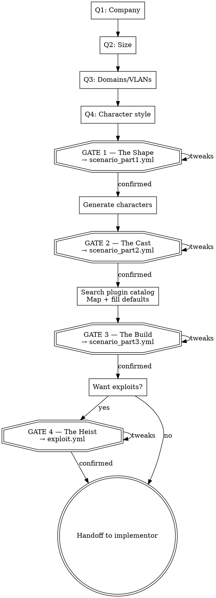

# Brainstorm Reference

> **For:** architect-brainstorm (loaded JIT when needed)
> **Purpose:** Visual formats, scaling guidance, defaults, detailed question examples, anti-patterns

---

## Visual Formats

Use box-drawing characters (`╔═╗║╚╝┌─┐│└┘▼►★↕`) for universal rendering.

### Scaling Guidance

| Scenario size | Approach |
|---------------|----------|
| Small/Mid (≤20 machines) | Every VLAN as its own box with zone + count |
| Large (21-40 machines) | Group VLANs by domain |
| Enterprise+ (40+ machines) | Compact table: one row per VLAN |

Fits on one screen. If the diagram would scroll, simplify.

### Gate 1 — Topology Visual

```
╔══════════════════════════════════════════════════════╗
║  Sienar Fleet Systems — defense-contractor (mid)     ║
╠══════════════════════════════════════════════════════╣
║                                                      ║
║  ┌─ sienar.local (root) ────────────────────────┐   ║
║  │  [Holonet GW]    [Sub-Level]  [Data Vault]   │   ║
║  │   dmz · 3         int · 7      mgmt · 4      │   ║
║  │   web,mail,vpn    DC + 6 ws    DC,fs,db,app  │   ║
║  └──────────────────────────────────────────────┘   ║
║                    ↕ bidirectional trust              ║
║  ┌─ cygnus.sienar.local (child) ────────────────┐   ║
║  │  [R&D Lab]                                    │   ║
║  │   int · 5 — DC + 3 ws + dev server           │   ║
║  └──────────────────────────────────────────────┘   ║
║                                                      ║
║  19 machines · 4 VLANs · 2 domains                   ║
╚══════════════════════════════════════════════════════╝
```

### Gate 2 — Character Roster Visual

Use bulleted markdown, NOT code blocks. Keep it clean and scannable:

**Sienar Fleet Systems — The Cast**

**sienar.local:**

- **Darth Vader** — CEO / Grand Moff · SUBLVL-WS-01
  - Hobbies: Force-choking keyboards, Sith holocrons
  - "DA because nobody dares revoke it. Password: Padme123"

- **Roy** — Reluctant Sysadmin · SUBLVL-WS-02
  - Hobbies: avoiding work, vintage synths
  - "DA on everything. Password: password123"

- ...

**cygnus.sienar.local:**

- ...

*9 characters · 2 domains · more added during build*

### Gate 3 — Plugin Mapping Visual

```
╔════════════════════════════════════════════════════════════════╗
║  Sienar Fleet Systems — Plugin Mapping                        ║
╠════════════════════════════════════════════════════════════════╣
║                                                                ║
║  Holonet Gateway                                               ║
║    Web Server       → Vuln Nostromo         ⚠ no IIS found    ║
║    Mail Relay       → Postfix Mail Relay                       ║
║    VPN Gateway      → OpenVPN Server                           ║
║                                                                ║
║  Imperial Data Vault                                           ║
║    DB Server        → MSSQL Server                             ║
║    App Server       → Internal Wiki                            ║
║                                                                ║
║  5 plugins · ⚠ 1 substitution                                 ║
║  Workstations, DCs, file servers = standard (no plugin needed) ║
╚════════════════════════════════════════════════════════════════╝
```

### Gate 4 — Exploit Path Visual

```
╔══════════════════════════════════════════════════════╗
║  Path: The Phantom Heist (hard)                      ║
╠══════════════════════════════════════════════════════╣
║                                                      ║
║  [External]                                          ║
║      │                                               ║
║      ▼ Nostromo web server vuln                      ║
║  [Holonet Gateway]                                   ║
║      │                                               ║
║      ▼ Phishing via mail relay                       ║
║  [The Sub-Level]                                     ║
║      │                                               ║
║      ▼ Jen's DA creds + Moss's passwords.txt         ║
║  [The Sub-Level → Cygnus R&D Lab]                    ║
║      │                                               ║
║      ▼ Cross-domain pivot via trust                  ║
║  [Imperial Data Vault]                               ║
║      │                                               ║
║      ▼ Lateral move to file server                   ║
║  ★ Project Phantom Schematics                        ║
║                                                      ║
╚══════════════════════════════════════════════════════╝
```

---

## Defaults Block

Auto-calculated from company size + security posture. User can override any at Gate 3.

```yaml
defaults:
  files_per_workstation: 12-18
  files_per_server: 5-10
  users_per_workstation: 1
  abandoned_profiles: 1-2
  default_technical_skill: mixed        # power_user | general_user | beginner | mixed
  default_filing_habits: mixed          # everything_on_desktop | organized_folders | minimal_files | mixed
  contractor_ratio: 20%
  network_policy: segmented             # flat | segmented | zero-trust
  dc_redundancy: auto                   # 1 for small, 2 for mid/large, 3 for enterprise+
  workstation_server_ratio: 75/25
  ou_depth: 2-3
  security_groups_count: auto
  forest_event_count: 3-5
  relationship_density: moderate        # light | moderate | dense
  user_events_per_user: 2-4
  shared_events_per_vlan: 3-5
```

---

## Detailed Question Guidance

### Q1 — Company

Explain how industry shapes the scenario:
- Healthcare — HIPAA, patient data, medical devices, clinical systems
- Finance — PCI-DSS, trading systems, wire transfers, customer financial data
- Defense — ITAR, classified docs, compartmentalized access, clearance levels
- Tech — CI/CD pipelines, cloud services, developer workstations, fast iteration

Enrich thin prompts. "A medium tech company" → propose regulatory landscape, narrative hook (acquisition, breach, compliance audit, rapid growth), state the enriched version, ask user to confirm.

### Q2 — Size

| Tier | Machines | Users | Domains | Notes |
|------|----------|-------|---------|-------|
| Small | 3-8 | 5-25 | 1 | Quick to build |
| Mid | 8-20 | 30-100 | 1-2 | Realistic corporate |
| Large | 15-40 | 100-500 | 1-3 | Complex trusts |
| Enterprise | 30-80 | 500-2000 | 2-5 | Full sim |
| Enterprise-Jumbo | 60-150 | 2000-10000 | 3-10 | Massive multi-site |

### Q3 — Domains and VLANs

Each layout should specify:
- Domains with VLANs nested inside
- Machine roles per VLAN (by role, not plugin)
- Trust relationships between domains
- Zone types: dmz, management, internal, isolated

Standalone VLANs with no AD domain use `fqdn: null`, `type: standalone`.

### Q5 — Exploit Paths

Concepts to explain conversationally if user is unfamiliar:
- **Crown jewels** — high-value targets (classified files, customer DBs, domain admin)
- **Entry points** — external (DMZ) or compromised insider workstation
- **Edges/hops** — techniques chaining together (cred theft, lateral movement, privesc)
- **Phishing** — crafted email via mail relay, user clicks, attacker gets foothold
- **Difficulty** — easy (3-4 hops), medium (5-6 hops), hard (6+ with cross-domain pivots)

---

## Self-Calibration

Before asking questions, count how many of these 6 dimensions the user provided: scale/machine count, topology/VLANs, industry/theme, attack types, specific technologies, narrative hooks/characters.

| Level | Dimensions | Action |
|-------|-----------|--------|
| HIGH | 4+ | Pre-fill answers, ask for confirmation |
| MEDIUM | 2-3 | Targeted questions on missing dimensions |
| LOW | 0-1 | Full question flow |

State calibration in the first response:
> **Calibration: [HIGH/MEDIUM/LOW]** — [N]/6 dimensions provided: [list].

3-round hard limit on follow-up clarifications beyond Q1-Q4. After 3, make creative decisions.

---

## Anti-Patterns

| Pattern | Instead |
|---------|---------|
| Combining questions in one message | Ask exactly one, then stop |
| Skipping a gate visual | Every phase ends with its visual + confirmation |
| Offering "just run with it" / "show me the spec" | Each phase has its own gate. The 4 YML files are the spec. |
| Collapsing phases | Every phase gets announced, presented, confirmed separately |
| Accepting "you decide" passively | Make opinionated creative choices |
| Generic company identities | Enrich with narrative hooks |
| Looking at plugin params | Params are the implementor's job |

---

## Process Flow

